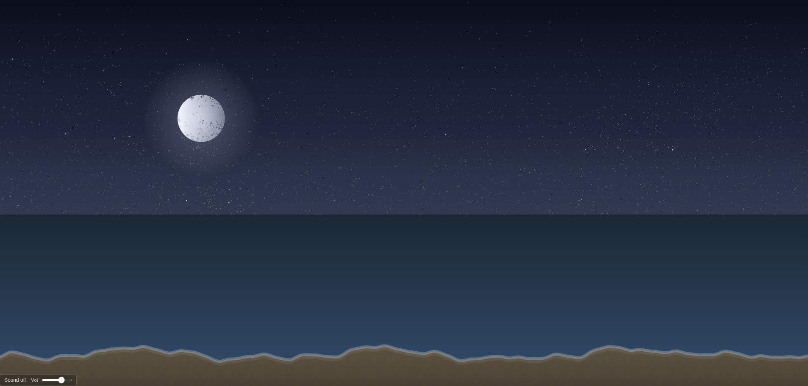

# Shoreline

A relaxing, procedural beach screensaver in the browser.



Watch the waves roll in, the sun and moon cross the sky, and seagulls land and take off—all driven by a single Go binary with no external assets.

## Features

- **Day/night cycle** — 15 real-time minutes = 24 simulated hours. Smooth dawn and dusk with twilight colors.
- **Sky** — Rayleigh and Mie atmospheric scattering, sun arc with limb darkening, moon with phase and terminator.
- **Stars** — Hipparcos-based catalog (mag ≤ 6.5), positioned by RA/Dec and local sidereal time. Smooth motion, no jumps.
- **Moon** — Phase, earthshine, and IAU-style lunar craters from embedded data.
- **Ocean** — Analytic + Gerstner-style waves, Fresnel-style reflection, shore foam, offshore whitecaps, and crystalline crests.
- **Beach** — Procedural sand texture that shifts with time of day.
- **Seagulls** — A few birds that fly, land on the beach, stand, and take off with smooth transitions.
- **Sound** — Optional YouTube livestream ambient audio (beach/ocean) with mute and volume controls.
- **Accessibility** — Fullscreen via <kbd>F</kbd>, respects `prefers-reduced-motion`, and sound is off until the user enables it.

## Run locally

```bash
# From the repo root
go run .

# Or build a single binary
go build -o shoreline .
./shoreline
```

Then open **http://localhost:8080** (or set `PORT` for a different port).

## URL options

| Query      | Effect                          |
| ---------- | ------------------------------- |
| `?day`     | Start at midday                 |
| `?night`   | Start at night                  |
| `?sunrise` | Start near sunrise              |
| `?sunset`  | Start near sunset               |

## Tech

- **Backend** — Go 1.21+, `net/http`, embedded `web/` and `web/data/` via `//go:embed`.
- **Frontend** — Vanilla JS, 2D canvas, `requestAnimationFrame`. No frameworks.
- **Data** — Hipparcos subset and lunar crater JSON are bundled; no runtime network calls for the scene (except optional YouTube audio after user interaction).

## Project structure

```
.
├── main.go           # HTTP server, embedded FS
├── go.mod
├── web/
│   ├── index.html
│   ├── style.css
│   ├── js/           # sky, ocean, sand, seagulls, sound, scene, main
│   └── data/         # hipparcos catalog, lunar craters JSON
└── README.md
```

## License

Use and modify as you like. No warranty.
